# waveshare-rlcd-agent-pet

English · [中文](README.zh-CN.md)

A desk companion on the Waveshare `ESP32-S3-RLCD-4.2` reflective LCD. It shows
what your coding agents are doing (Codex, Claude Code, Hermes, OpenClaw). It is
also a clock, shows the board's battery and room climate, and can play 1-bit
videos as an easter egg. On the Mac, a small bridge collects agent status, and
a web dashboard and a menu bar app let you check and control everything.

<table>
  <tr>
    <td>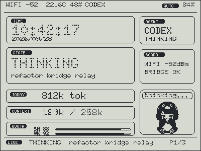</td>
    <td>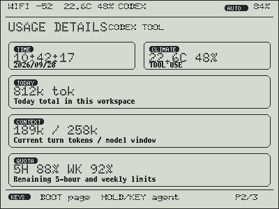</td>
    <td>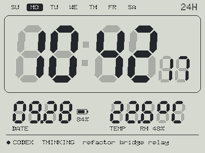</td>
  </tr>
  <tr>
    <td align="center">Overview</td>
    <td align="center">Usage</td>
    <td align="center">Clock</td>
  </tr>
</table>

The screen images in this README come from the firmware's own drawing code
(see [Previews without hardware](#previews-without-hardware)): the pixels are
exact, but the reflective panel looks different in a room.

## What the board shows

- **Overview:** which agent is active and what it is doing (thinking, using a
  tool, searching, waiting for you, done), the task, a pixel pet whose mood
  follows the agents, time, battery, temperature and humidity, Wi-Fi and
  bridge status.
- **Usage:** today's tokens, the context window and the 5-hour / weekly quota
  for Codex, and today's tokens, context and model for Claude Code.
- **Clock:** a full-screen clock in seven faces, with the date, room climate
  and the agents' status. It keeps time from the board's RTC (stored in UTC)
  with the Mac's time zone and daylight saving rules.

<table>
  <tr>
    <td>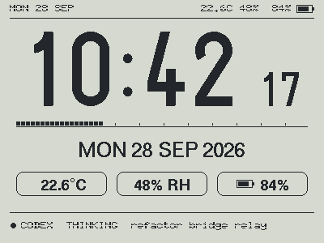</td>
    <td></td>
    <td>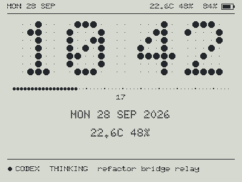</td>
    <td>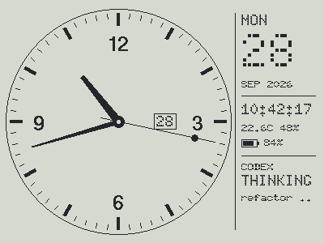</td>
  </tr>
  <tr>
    <td align="center">Sans</td>
    <td align="center">Seven-segment</td>
    <td align="center">Dot matrix</td>
    <td align="center">Analog dial</td>
  </tr>
  <tr>
    <td>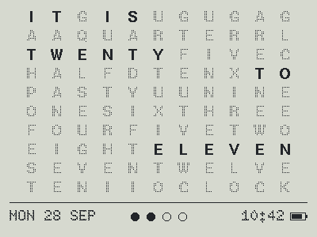</td>
    <td>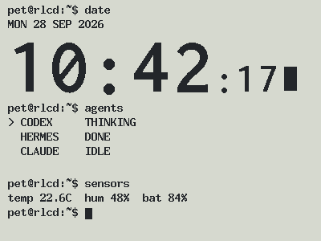</td>
    <td>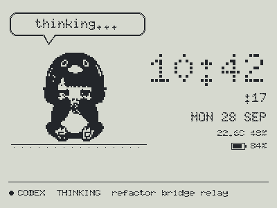</td>
    <td>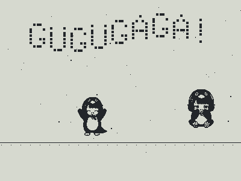</td>
  </tr>
  <tr>
    <td align="center">Word clock</td>
    <td align="center">Terminal</td>
    <td align="center">Pet</td>
    <td align="center">Built-in easter egg</td>
  </tr>
</table>

## On the Mac

- **Bridge** (`bridge/codex-pet-bridge`): collects agent status and serves the
  board. It follows Codex sessions, reads Claude Code's session transcripts
  (no Claude configuration needed), receives Hermes hooks and the OpenClaw
  plugin, and runs `agent-sync` for the rest. It runs as two LaunchAgents.
- **Dashboard** at `http://127.0.0.1:17366/ui/`: agents, board telemetry,
  clock face picker, time zone, and the easter-egg studio.
- **PetBar** menu bar app: the same status at a glance. From its menu you can
  switch the board's page and clock face, play the easter egg, open the
  dashboard and restart the bridge.

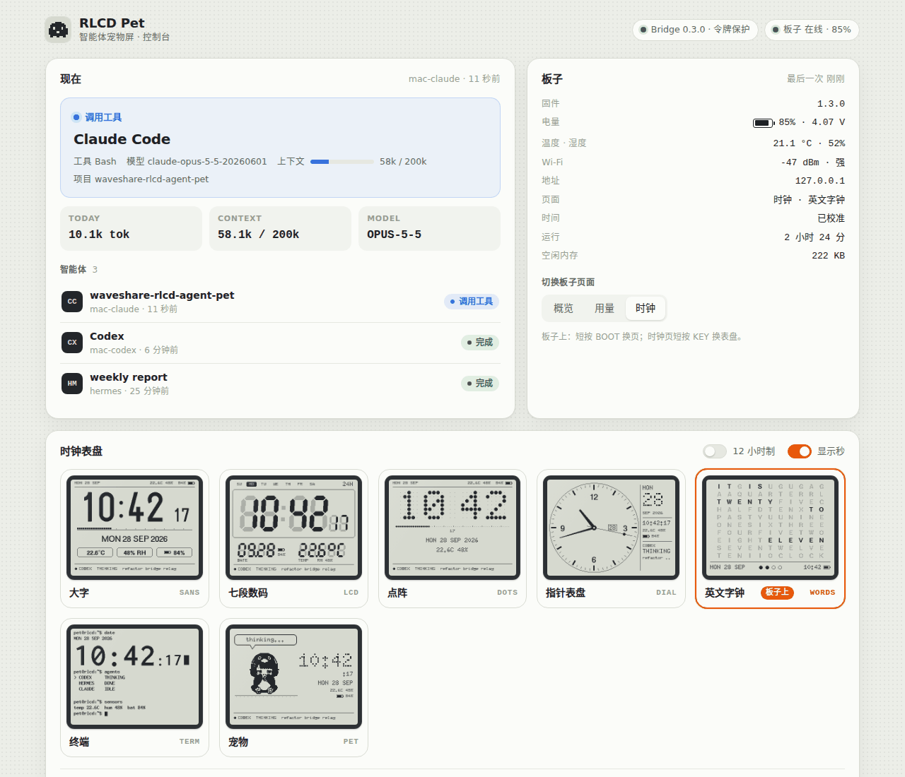

### The easter egg

In the dashboard's easter-egg studio (彩蛋工坊), drop in a local video, for
example your own copy of *Bad Apple!!*. The browser turns it into 1-bit frames
(threshold or dither, 10–30 fps, full screen or half size). Only those frames
are uploaded to the bridge on your Mac; the video never leaves the browser.
Press play and the board streams the frames in 16 KB chunks, on a schedule
shared with the Mac, so the Mac can play the video's sound in sync. Holding
BOOT + KEY on the board for 2 seconds plays the default animation, or a
built-in one when nothing is uploaded.

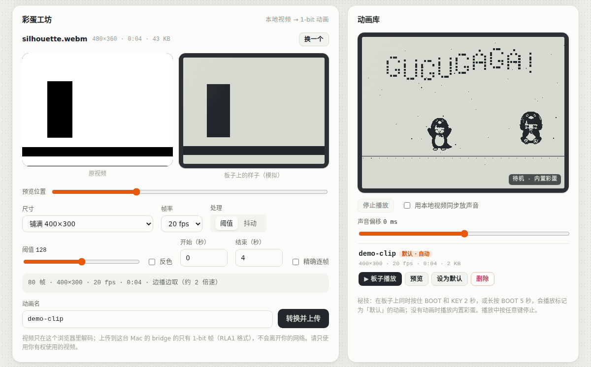

## How it fits together

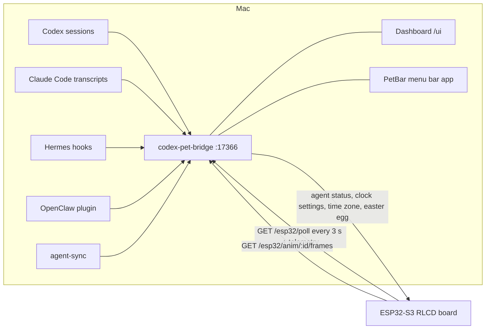

The board polls the bridge with a token. It sends its battery, climate, Wi-Fi
signal, page and firmware version with every request. The bridge's answer
carries the agent status plus any clock settings, the time zone and
easter-egg commands. On the board, a FreeRTOS task on the second core does all
the networking, so a slow network never freezes the screen or the seconds.

## Quick start (Mac)

To have an agent do the install, give it [docs/AGENT_INSTALL.md](docs/AGENT_INSTALL.md).
It covers checks, permissions and troubleshooting. By hand:

```bash
git clone https://github.com/xyuuii/waveshare-rlcd-agent-pet.git
cd waveshare-rlcd-agent-pet

# 1. Bridge as LaunchAgents: the first run only shows the plan, --apply does it
bridge/codex-pet-bridge/tools/mac/install.sh
bridge/codex-pet-bridge/tools/mac/install.sh --apply

# 2. Board settings (git-ignored): asks for the Wi-Fi name and password and
#    builds the bridge URL from this Mac's LAN address and the bridge token
cd firmware/agent_pet_display
tools/make-secrets.sh

# 3. Test, build and flash (find the port with: pio device list, VID:PID 303A:1001)
pio test -e native
pio run -e waveshare_rlcd -t upload --upload-port /dev/cu.usbmodem101

# 4. Menu bar app
../../bridge/codex-pet-bridge/macos/PetBar/build.sh --install
```

Give the Mac a fixed LAN address (a DHCP reservation), because the address is
compiled into the firmware. If an older checkout still has real values inside
`include/app_config.h`, `tools/import-legacy-secrets.sh <old app_config.h>`
copies them into `secrets.h` instead of step 2.

The bridge also runs anywhere Node 20 runs: `node bridge/codex-pet-bridge/src/bridge-server.js`
listens on `127.0.0.1` without a token. For LAN use, see
[bridge/codex-pet-bridge/docs/SECURITY.md](bridge/codex-pet-bridge/docs/SECURITY.md).

## Buttons

| Button | Press | Overview / usage page | Clock page |
| --- | --- | --- | --- |
| BOOT | short | next page (overview → usage → clock) | next page |
| BOOT | 1.5 s | follow the next agent | next clock face |
| KEY | short or 1.5 s | follow the next agent | next clock face |
| BOOT + KEY | hold both 2 s | easter egg | easter egg |
| BOOT | hold 5 s | easter egg | easter egg |
| any | while the egg plays | stop it | stop it |

The clock face, 12/24 h and seconds can also be set in the dashboard or PetBar,
and they survive a reboot.

## Repository layout

| Path | What |
| --- | --- |
| `firmware/agent_pet_display/` | PlatformIO firmware: screens, clock faces, pet state machine, network task, easter-egg player |
| `firmware/agent_pet_display/tools/` | `make-secrets.sh`, `import-legacy-secrets.sh`, `native_tests.sh`, `host_render/` |
| `bridge/codex-pet-bridge/` | the bridge ([README](bridge/codex-pet-bridge/README.md) · [中文](bridge/codex-pet-bridge/README.zh-CN.md)) |
| `bridge/codex-pet-bridge/ui/` | the dashboard (static files served by the bridge) |
| `bridge/codex-pet-bridge/tools/mac/` | Mac installer and its test |
| `bridge/codex-pet-bridge/macos/PetBar/` | the menu bar app (Swift, built with the Command Line Tools) |
| `tools/contract-test.sh` | checks the bridge ⇄ firmware protocol with the real code on both sides |
| `docs/AGENT_INSTALL.md` | install runbook for coding agents |

## Development

| Check | Command |
| --- | --- |
| Firmware unit tests (108) | `cd firmware/agent_pet_display && pio test -e native` |
| Firmware build | `pio run -e waveshare_rlcd` |
| Bridge tests | `cd bridge/codex-pet-bridge && node --test` |
| Bridge ⇄ firmware contract | `tools/contract-test.sh` |
| Dashboard end to end (Chromium) | `node bridge/codex-pet-bridge/tools/ui-e2e.mjs <video>` |
| Mac installer | `bridge/codex-pet-bridge/tools/mac/test-install.sh` |

Without PlatformIO, `firmware/agent_pet_display/tools/native_tests.sh` builds and
runs the same native tests with the system compiler.

### Previews without hardware

`firmware/agent_pet_display/tools/host_render/build.sh` compiles the real drawing
code and U8g2 for the host and writes every screen as a 400×300 image.
`tools/host_render/export_ui_previews.py` turns them into the dashboard's
face previews.

## Security and privacy

- The bridge listens on the LAN only with a token. The token lives in
  `~/.codex-pet-bridge/token` (0600), not in LaunchAgent plists or the repo.
- The dashboard API answers only same-origin requests to the machine's own
  addresses, so other web pages cannot read it or reach it through DNS
  rebinding.
- Wi-Fi and bridge credentials for the board live in the git-ignored
  `include/secrets.h`; the helper scripts never print them.
- Videos for the easter egg are decoded in the browser. Only 1-bit frames reach
  the bridge, and they stay on the Mac.

## Hardware notes

- Board: Waveshare `ESP32-S3-RLCD-4.2` (ESP32-S3, 16 MB flash)
- Display: 300×400 ST7305 monochrome reflective LCD, used as 400×300
- RTC: `PCF85063`; climate sensor: `SHTC3`
- Buttons: BOOT (GPIO0) and KEY (GPIO18)
- Power: ADC battery reading; the charge-state GPIO is not known yet
  (`kChargeSensePin = -1`)

## Upstream and attribution

This repo includes or derives from several MIT-licensed upstream components:

- `bridge/codex-pet-bridge` is based on the `codex-pet-bridge` project
- `firmware/agent_pet_display/lib/SensorLib` is from Lewis He
- the RLCD board support and wiring were adapted from Waveshare examples
- the GUGUGAGA pet artwork was converted to a monochrome RLCD bitmap from
  [`drlrf/cc-guga`](https://github.com/drlrf/cc-guga), which publishes the
  `pets/gugugaga` package under the MIT License
- the Doto font is used under the SIL Open Font License (see
  `firmware/agent_pet_display/THIRD_PARTY_NOTICES.md`)

See the preserved license files inside those directories for details.
