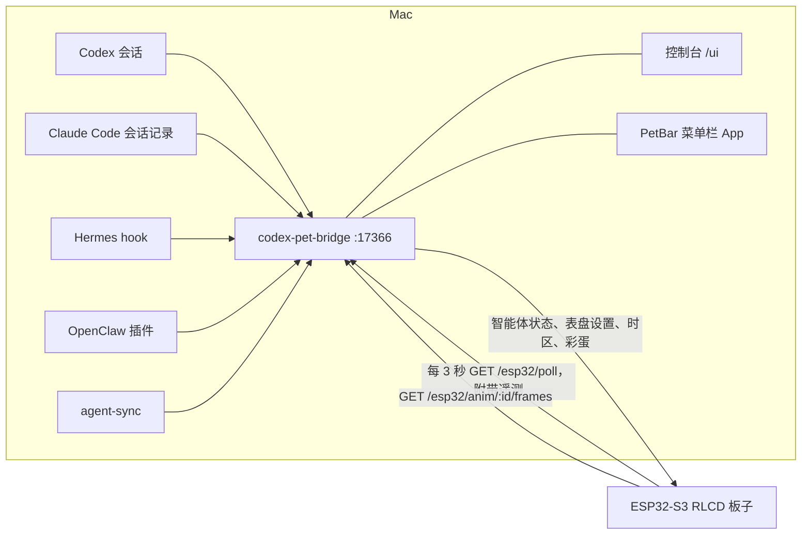

# waveshare-rlcd-agent-pet

[English](README.md) · 中文

一块放在桌上的反射式屏幕（Waveshare `ESP32-S3-RLCD-4.2`），用来显示你的编程智能体在做什么：Codex、Claude Code、Hermes、OpenClaw。它同时是一块时钟，显示电量和室内温湿度，还藏了一个能播放 1-bit 视频的彩蛋。Mac 上有一个小小的 bridge 负责收集状态，另有网页控制台和菜单栏 App 用来查看和控制。

<table>
  <tr>
    <td></td>
    <td></td>
    <td></td>
  </tr>
  <tr>
    <td align="center">概览</td>
    <td align="center">用量</td>
    <td align="center">时钟</td>
  </tr>
</table>

本页的屏幕图都由固件自己的绘图代码渲染（见[不接硬件也能看效果](#不接硬件也能看效果)）。像素和实物一致，但反射屏在房间里的观感会不同。

## 板子上显示什么

- **概览**：哪个智能体在活动、在做什么（思考、调用工具、搜索、等你处理、完成），任务名。一只心情跟着智能体变化的像素宠物，外加时间、电量、温湿度、Wi-Fi 和 bridge 状态。
- **用量**：Codex 的今日 token、上下文窗口、5 小时和每周额度；Claude Code 的今日 token、上下文和模型。
- **时钟**：七种表盘的全屏时钟，附带日期、室内温湿度和智能体状态。时间来自板载 RTC（按 UTC 保存），时区和夏令时规则跟随 Mac。

<table>
  <tr>
    <td></td>
    <td></td>
    <td></td>
    <td></td>
  </tr>
  <tr>
    <td align="center">大字</td>
    <td align="center">七段数码</td>
    <td align="center">点阵</td>
    <td align="center">指针表盘</td>
  </tr>
  <tr>
    <td></td>
    <td></td>
    <td></td>
    <td></td>
  </tr>
  <tr>
    <td align="center">英文字钟</td>
    <td align="center">终端</td>
    <td align="center">宠物</td>
    <td align="center">内置彩蛋</td>
  </tr>
</table>

## Mac 端

- **Bridge**（`bridge/codex-pet-bridge`）：收集智能体状态，也是板子的数据来源。它跟踪 Codex 会话，读取 Claude Code 的会话记录（无需修改 Claude 的配置），接收 Hermes hook 和 OpenClaw 插件的事件，其余情况交给 `agent-sync`。以两个开机启动项（LaunchAgent）的形式运行。
- **控制台** `http://127.0.0.1:17366/ui/`：智能体状态、板子遥测、表盘选择、时区和彩蛋工坊。
- **PetBar 菜单栏 App**：一眼看到同样的状态。在菜单里可以切换板子页面和表盘、播放彩蛋、打开控制台、重启 bridge。


### 彩蛋

在控制台的「彩蛋工坊」里拖入一个本地视频，比如你自己的 *Bad Apple!!*。浏览器会把它转成 1-bit 帧，可选阈值或抖动、10–30 fps、铺满或半尺寸。视频自带的黑边（比如 16:9 文件里的 4:3 画面）会被自动找到并裁掉，画面可以选填满屏幕或保留完整。只有这些黑白帧会上传到你 Mac 上的 bridge，视频本身不会离开浏览器。点播放后，板子以 16 KB 为一块流式下载帧，并和 Mac 按同一个时间表播放，所以 Mac 可以同步放出视频原声。在板子上同时按住 BOOT 和 KEY 2 秒，会播放默认动画；没有上传动画时播放内置彩蛋。


## 各部分怎么连在一起



板子带着令牌轮询 bridge，每次都附上电量、温湿度、Wi-Fi 信号、当前页面和固件版本。bridge 的回复里除了智能体状态，还有表盘设置、时区和彩蛋指令。板子上的网络请求全部在第二个核心的 FreeRTOS 任务里完成，网络再慢也不会卡住屏幕和秒针。

## 快速开始（Mac）

想让智能体代为安装，把 [docs/AGENT_INSTALL.md](docs/AGENT_INSTALL.md) 交给它即可，里面有检查步骤、需要征求同意的操作和排错方法。手动安装：

```bash
git clone https://github.com/xyuuii/waveshare-rlcd-agent-pet.git
cd waveshare-rlcd-agent-pet

# 1. 以开机启动项安装 bridge：第一次只显示计划，加 --apply 才执行
bridge/codex-pet-bridge/tools/mac/install.sh
bridge/codex-pet-bridge/tools/mac/install.sh --apply

# 2. 板子配置（git 忽略）：询问 Wi-Fi 名称和密码，
#    用这台 Mac 的局域网地址和 bridge 令牌拼出 bridge 地址
cd firmware/agent_pet_display
tools/make-secrets.sh

# 3. 测试、编译、烧录（端口用 pio device list 找 VID:PID 303A:1001）
pio test -e native
pio run -e waveshare_rlcd -t upload --upload-port /dev/cu.usbmodem101

# 4. 菜单栏 App
../../bridge/codex-pet-bridge/macos/PetBar/build.sh --install
```

请在路由器上给 Mac 固定局域网地址（DHCP 保留），因为这个地址会编进固件。如果旧的代码目录里 `include/app_config.h` 还写着真实配置，可以用 `tools/import-legacy-secrets.sh <旧的 app_config.h>` 代替第 2 步，把值搬进 `secrets.h`。

bridge 在任何装有 Node 20 的机器上都能跑：`node bridge/codex-pet-bridge/src/bridge-server.js` 默认只监听 `127.0.0.1`，不需要令牌。要在局域网里用，请看 [bridge/codex-pet-bridge/docs/SECURITY.md](bridge/codex-pet-bridge/docs/SECURITY.md)。

## 按键

| 按键 | 操作 | 概览 / 用量页 | 时钟页 |
| --- | --- | --- | --- |
| BOOT | 短按 | 下一页（概览 → 用量 → 时钟） | 下一页 |
| BOOT | 按住 1.5 秒 | 切换跟随的智能体 | 下一个表盘 |
| KEY | 短按或按住 1.5 秒 | 切换跟随的智能体 | 下一个表盘 |
| BOOT + KEY | 一起按住 2 秒 | 彩蛋 | 彩蛋 |
| BOOT | 按住 5 秒 | 彩蛋 | 彩蛋 |
| 任意键 | 彩蛋播放中 | 停止 | 停止 |

表盘、12/24 小时制和秒也可以在控制台或 PetBar 里设置，重启后保留。

## 目录结构

| 路径 | 内容 |
| --- | --- |
| `firmware/agent_pet_display/` | PlatformIO 固件：各页面、表盘、宠物状态机、网络任务、彩蛋播放 |
| `firmware/agent_pet_display/tools/` | `make-secrets.sh`、`import-legacy-secrets.sh`、`native_tests.sh`、`host_render/` |
| `bridge/codex-pet-bridge/` | bridge（[README](bridge/codex-pet-bridge/README.md) · [中文](bridge/codex-pet-bridge/README.zh-CN.md)） |
| `bridge/codex-pet-bridge/ui/` | 控制台（由 bridge 提供的静态页面） |
| `bridge/codex-pet-bridge/tools/mac/` | Mac 安装脚本及其测试 |
| `bridge/codex-pet-bridge/macos/PetBar/` | 菜单栏 App（Swift，用 Command Line Tools 编译） |
| `tools/contract-test.sh` | 用两端的真实代码检查 bridge ⇄ 固件协议 |
| `docs/AGENT_INSTALL.md` | 给编程智能体的安装手册 |

## 开发

| 检查 | 命令 |
| --- | --- |
| 固件单元测试（108 个） | `cd firmware/agent_pet_display && pio test -e native` |
| 固件编译 | `pio run -e waveshare_rlcd` |
| bridge 测试 | `cd bridge/codex-pet-bridge && node --test` |
| bridge ⇄ 固件协议 | `tools/contract-test.sh` |
| 控制台端到端（Chromium） | `node bridge/codex-pet-bridge/tools/ui-e2e.mjs <视频>` |
| Mac 安装脚本 | `bridge/codex-pet-bridge/tools/mac/test-install.sh` |

没有 PlatformIO 时，`firmware/agent_pet_display/tools/native_tests.sh` 会用系统编译器编译并运行同一批单元测试。

### 不接硬件也能看效果

`firmware/agent_pet_display/tools/host_render/build.sh` 用电脑编译真实的绘图代码和 U8g2，把每个画面输出成 400×300 的图片。`tools/host_render/export_ui_previews.py` 再把它们转成控制台里的表盘预览图。

## 安全与隐私

- bridge 只有在设置了令牌时才监听局域网。令牌保存在 `~/.codex-pet-bridge/token`（权限 0600），不写进开机启动项的 plist，也不进仓库。
- 控制台 API 只接受发往本机地址的同源请求，其他网页读不到，也无法借 DNS rebinding 访问。
- 板子的 Wi-Fi 和 bridge 凭据放在 git 忽略的 `include/secrets.h` 里，辅助脚本不会打印它们。
- 彩蛋视频在浏览器里解码，只有 1-bit 帧会到达 bridge，并且留在 Mac 上。

## 硬件说明

- 板子：Waveshare `ESP32-S3-RLCD-4.2`（ESP32-S3，16 MB 闪存）
- 屏幕：300×400 ST7305 单色反射式 LCD，按 400×300 横屏使用
- RTC：`PCF85063`；温湿度传感器：`SHTC3`
- 按键：BOOT（GPIO0）和 KEY（GPIO18）
- 电源：用 ADC 读电池电压；充电状态引脚还没确定（`kChargeSensePin = -1`）

## 上游与致谢

本仓库包含或改编自以下 MIT 许可的上游组件：

- `bridge/codex-pet-bridge` 基于 `codex-pet-bridge` 项目
- `firmware/agent_pet_display/lib/SensorLib` 来自 Lewis He
- RLCD 板级支持和接线改编自 Waveshare 示例
- GUGUGAGA 宠物形象由 [`drlrf/cc-guga`](https://github.com/drlrf/cc-guga) 以 MIT 许可发布的 `pets/gugugaga` 转换为单色 RLCD 位图
- Doto 字体按 SIL Open Font License 使用（见 `firmware/agent_pet_display/THIRD_PARTY_NOTICES.md`）

各目录中保留了对应的许可文件。
